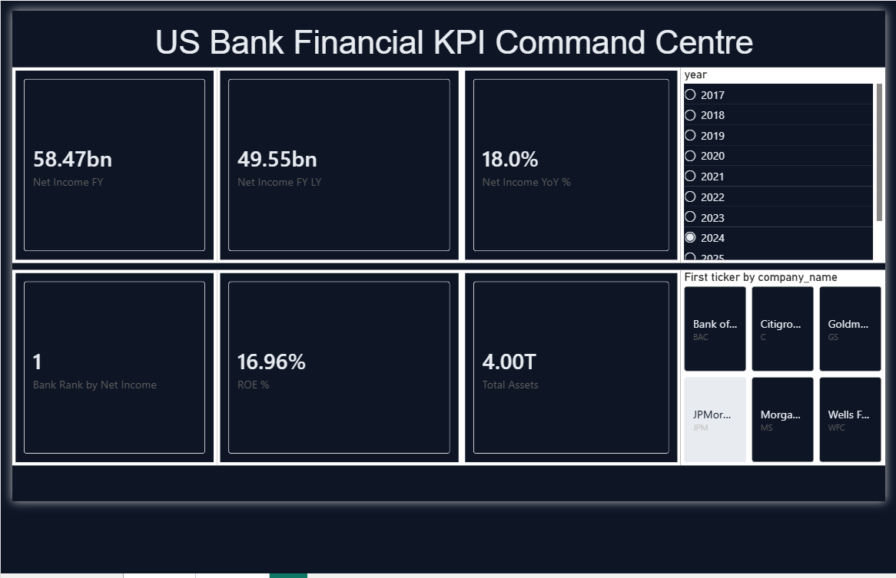
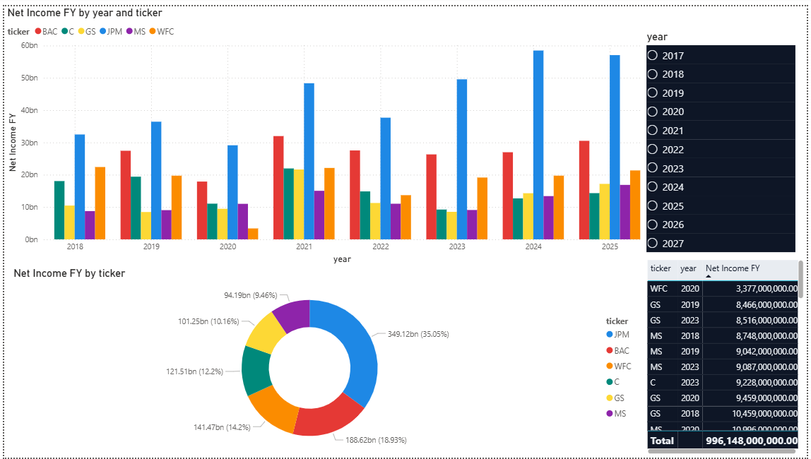
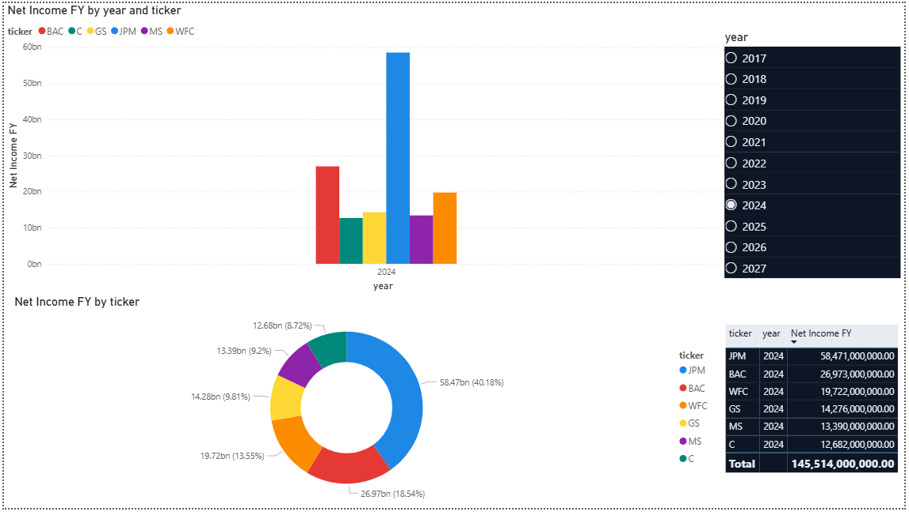
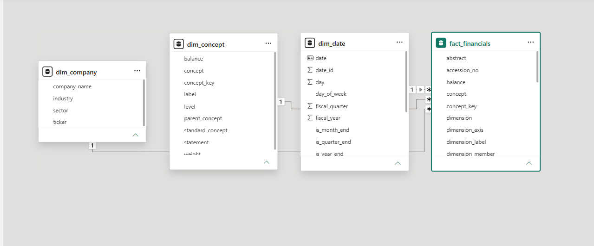

# US Bank Financial KPI Command Centre

An interactive Power BI dashboard analyzing 5 years of SEC EDGAR XBRL financial filings for the 6 largest US banks, built on a star-schema data model with semi-additive measures, time intelligence, and real-time concept-level filtering.

**Live data:** 19,910 fact rows from 393 SEC filings (JPM, BAC, WFC, C, GS, MS, 2018–2025)
**Validation:** All KPI values cross-checked against publicly reported figures (see [DAX Reference](docs/dax_reference.md))

---

## Screenshots

### Page 1 — KPI Overview (filtered: JPM, 2024)


7 dynamic KPIs across the top: Net Income (current + prior year + YoY%), Total Assets, Total Equity, ROE %, and bank rank. Two slicers (year + ticker) cascade filters across all measures.

### Page 2 — Trend Analysis (all years, all banks)


Clustered column chart shows the full 8-year Net Income trajectory by bank. JPM consistently leads, 2021 spike across all banks (post-COVID stimulus), 2020 dip (COVID impact especially for WFC).

### Page 2 — Filtered to 2024


Same page with year=2024 filter applied — donut shows JPM commands 40% of total industry net income; matrix breaks out each bank's contribution.

### Model View — Star Schema


1 fact table + 3 dimensions, all relationships Many-to-One Single-direction. dim_date marked as date table (calendar icon visible).

---

## Architecture

```
┌─────────────────┐
│  SEC EDGAR API  │   393 XBRL filings (10-K + 10-Q)
└────────┬────────┘
         │ edgartools 5.x
         ▼
┌─────────────────┐
│  Raw parquets   │   data/raw/edgar/{ticker}/{filing}.parquet
└────────┬────────┘   (7.1 MB across 6 banks)
         │ src/transform.py
         ▼
┌─────────────────┐
│  Star schema    │   fact_financials.parquet (19,910 rows)
│   parquets      │   dim_company.parquet     (6 rows)
└────────┬────────┘   dim_concept.parquet     (443 rows)
         │            dim_date.parquet         (4,017 rows)
         ▼            (~470 KB total)
┌─────────────────┐
│  Power BI       │   8 DAX measures
│   Desktop       │   3 relationships
└─────────────────┘   2 report pages
```

---

## Tech Stack

| Layer | Technology |
|---|---|
| **Data extraction** | Python 3.11, `edgartools` 5.x |
| **Transform / star schema** | pandas 3.x, pyarrow |
| **Storage** | Apache Parquet |
| **BI tool** | Power BI Desktop (2026.x) |
| **Theming** | Custom JSON theme (dark navy + brand-matched bank colors) |
| **Testing** | pytest (8 tests) |
| **Version control** | Git + GitHub |

---

## Key Engineering Decisions

### 1. XBRL Double-Count Detection

Initial DAX showed Net Income at exactly **2× reported values** for every bank. Root cause: `us-gaap_NetIncomeLoss` appears in both the income statement and the cashflow statement (as the indirect-method starting point). Fixed by adding `dim_concept[statement] = "income"` filter in DAX.

### 2. Semi-Additive Balance Sheet Pattern

Total Assets initially summed across quarterly snapshots (~2× to 4× the real value). Fixed with a data-aware LASTDATE pattern using `MAX(fact_financials[period_end_date])` instead of `LASTDATE(dim_date[date])` — survives the time-table date padding without returning blanks.

### 3. Composite-Key Dimensional Modelling

Single-column `concept` join produced Many-to-Many cardinality (same concept code in multiple statements). Solved with composite key `concept_key = concept + "|" + statement`, lowercase-normalized to handle PBI's case-insensitive string comparison.

Full engineering write-up in [docs/dax_reference.md](docs/dax_reference.md).

---

## Repo Structure

```
bi-financial-kpi-command-centre/
├── data/
│   ├── raw/edgar/                          # 393 raw filing parquets
│   └── processed/                          # Star schema (4 parquets)
├── pbi/
│   ├── financial_kpi_command_centre.pbix   # The Power BI workbook
│   └── bank-theme.json                     # Custom dark theme
├── src/
│   ├── config.py                           # Tickers, dates, paths
│   ├── ingest_edgar.py                     # SEC EDGAR extraction
│   └── transform.py                        # Wide -> long star schema
├── tests/                                  # pytest tests (8 passing)
├── docs/
│   ├── screenshots/
│   │   ├── page1_overview.png
│   │   ├── page2_trend_allyears.png
│   │   ├── page2_filtered_2024.png
│   │   └── model_view.png
│   ├── measures.tmdl                       # DAX measure library
│   └── dax_reference.md                    # Engineering rationale
├── requirements.txt
├── README.md                               # You are here
└── .gitignore
```

---

## Reproduce From Scratch

```bash
# Clone
git clone https://github.com/fahadamjad009/bi-financial-kpi-command-centre.git
cd bi-financial-kpi-command-centre

# Python environment
python -m venv .venv
source .venv/bin/activate              # Linux/Mac
# .venv\Scripts\Activate.ps1           # Windows PowerShell
pip install -r requirements.txt

# 1. Ingest from SEC EDGAR (takes ~5-10 min, 393 filings)
python src/ingest_edgar.py

# 2. Build the star schema
python src/transform.py

# 3. Open the dashboard
# Open pbi/financial_kpi_command_centre.pbix in Power BI Desktop
# Refresh data (Home > Refresh) to load the freshly-built parquets
```

The Power BI file is bound to relative paths under `data/processed/` so refresh should work once the parquets are regenerated.

---

## Validation

All DAX measures sense-checked against publicly reported financials. Sample (full table in [docs/dax_reference.md](docs/dax_reference.md)):

| Bank | 2024 Net Income (dashboard) | Reported | ✓ |
|---|---|---|---|
| JPM | $58.47B | ~$58.5B | ✓ |
| BAC | $26.97B | ~$27.0B | ✓ |
| **Big 6 Total** | **$145.51B** | **~$145B** | **✓** |

---

## What I Learned

1. **XBRL data is messier than it looks.** A given concept code can appear in 2–3 statements per filing, all with the same value but different `statement` context. Naive aggregation double- or triple-counts. Filter by statement explicitly.

2. **Pandas dedup is case-sensitive; Power BI string comparison isn't.** Two rows that pandas sees as distinct (`bac_Proceedsfrom...` vs `bac_ProceedsFrom...`) collapse in PBI's view of the same column. Lowercase-normalize when crossing that boundary.

3. **`LASTDATE` against a padded date dimension returns blanks at the edges.** Future dates added for time-intelligence support have no fact data. Use `MAX(fact_table[date_column])` instead for measures that need the latest date with actual data.

4. **Star schema discipline matters even at small scale.** Composite keys for multi-grain dims, single-direction filtering, dim_date marked as date table — these aren't ceremony; they prevent the silent-failure modes that make portfolio dashboards lie.

---

## License

MIT (for code).

Data is sourced from publicly available SEC EDGAR filings (public domain).
